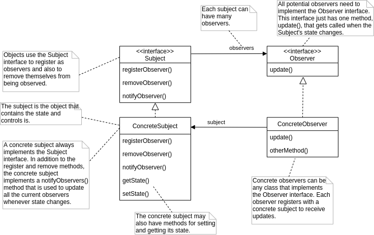
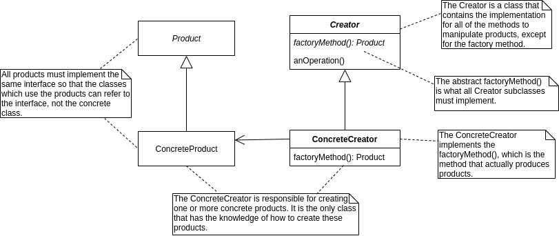
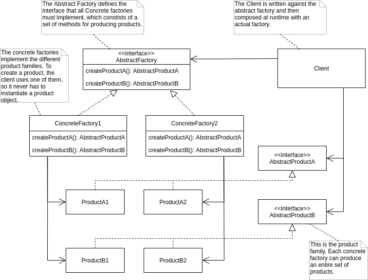
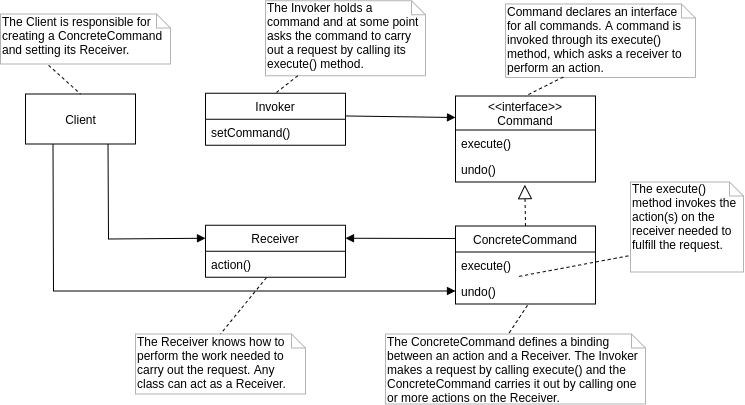
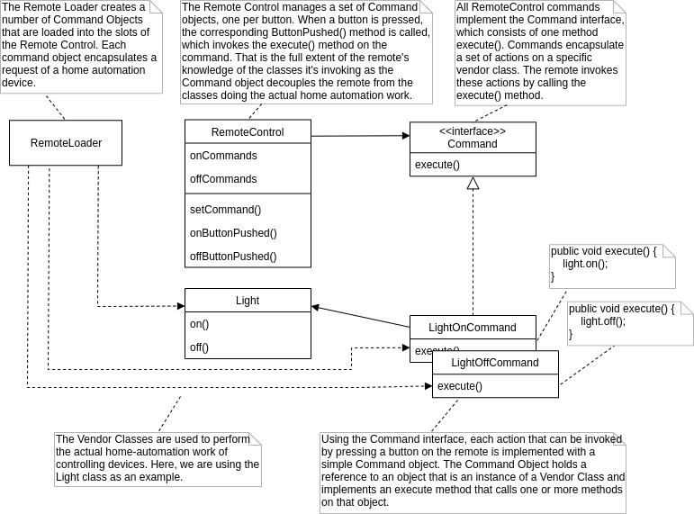
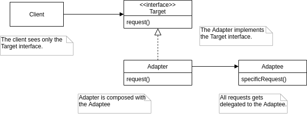
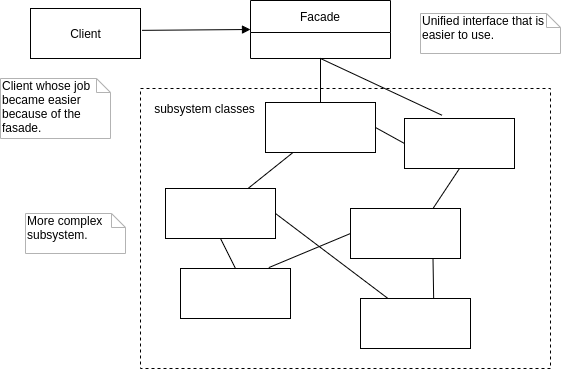
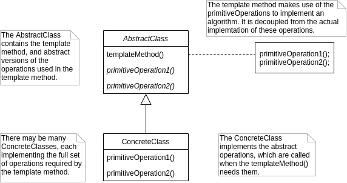
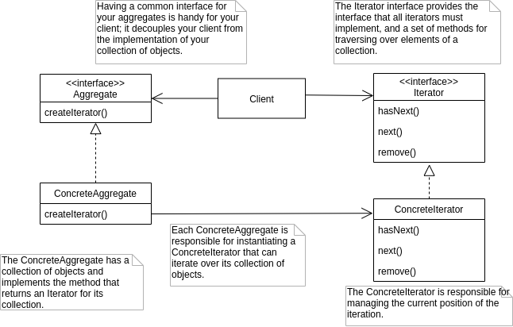

Design Patterns
===============

* [The Observer Pattern](#observer")
* [The Factory Method Pattern](#factory-method)
* [The Abstract Factory Pattern](#abstract-factory)
* [The Command Pattern](#command)
* [The Adapter Pattern](#adapter)
* [The Facade Pattern](#fasade)
* [The Template Method Pattern](#template-method)
* [The Iterator Pattern](#iterator)


The Observer Pattern<a name="observer"></a>
--------------------

The Observer Pattern defines a one-to-meny dependency between objects so that when one object changes state, all of its dependents are notified and updated automatically.




The Factory Method Pattern<a name="factory-method"></a>
--------------------------

The Factory Method Pattern defines an interface for creating an object, but lets subclasses decide which class to instantiate. Factory Method lets a class defer instantiation to subclass.




The Abstract Factory Pattern<a name="abstract-factory"></a>
----------------------------

The Abstract Factory Pattern provides an interface for creating families of related or dependent objects without specifying their concrete classes.




The Command Pattern<a name="command"></a>
-------------------

The Command Pattern encapsulates a request as an object, thereby letting you parameterize other objects with different requests, queue or log requests, and support undoable operations.

The Command Pattern us used when you need to decouple an object making request from the objects that know how to perform the requests.



### The Command Pattern (Remote Control API Design Example)

The Command Pattern is employed to logically decouple the RemoteControl class from the Vendor Classes, so that the RemoteControl doesn't require changes as new vendor classes are produced.




The Adapter Pattern<a name="adapter"></a>
-------------------

The Adapter Pattern converts the interface of a class into another interface the clients expect. Adapter lets classes work together hat couldn't otherwise because of incompatible interfaces.




The Facade Pattern<a name="fasade"></a>
------------------

The Facade Pattern provides a unified interface to a set of interfaces in a subsystem. Facade defines a higher level interface that makes the subsystem easier to use.




The Principle of Least Knowledge
--------------------------------

__Talk only to your immediate frieds.__

Guidelines:  
take any object; now from any method in that object, we should only invoke methods that belong to:  
* The object itself
* Objects passed in as a parameter to the method
* Any object the method creates or instantiates
* Any components of the object.

It means __not to call methods on objects that were returned from calling other method.__


The Template Method Pattern<a name="template-method"></a>
---------------------------

The Template Method Pattern defines the skeleton of an algorithm in a method,
deferring some steps to subclasses. Template Method lets subclasses redefine
certain steps of an algorithm without changing the algorithm's structure.



```Java
abstract class AbstractClass {
    /*
     * The template method is declared final to prevent subclasses
     * from reworking the sequence of steps in the algorithm.
     */
    public final void templateMetod() {
        primitiveOperation1();
        primitiveOperation2();
        concreteOperation();
        hook();
    }

    public abstract void primitiveOperation1();

    public abstract void primitiveOperation2();

    public final void concreteOperation() {
        // implementation here
    }
    
    /*
     * Hook methods do nothing by default, but subclasses are free to override these.
     */
    protected void hook() {}
}
```


The Iterator Pattern<a name="iterator"></a>
--------------------

The Iterator Pattern provides a way to access the elements of an aggregate object
sequentially without exposing its underlying representation.




